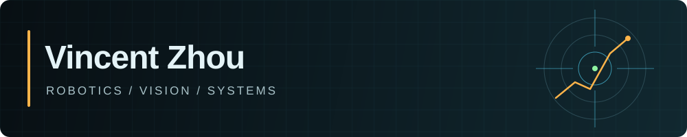

  
  
  

### 👋 About me

I'm a Computer Engineering student at the **University of Waterloo** and **Autonomy Project Manager at Waterloo Aerial Robotics Group (WARG)**. I enjoy robotics, computer vision, machine learning, backend development, and distributed systems. My work spans flight software, simulation, AI/ML, and full-stack applications. I like understanding how the pieces fit together and making them work reliably in the real world.

### 🛠️ Skills

**Languages ⌨️:** `Python` `C++` `TypeScript/JavaScript` `Java` `SQL` `Bash` `Lua` `Verilog`

**Robotics 🤖:** `ROS 2` `ArduPilot/MAVROS` `MAVLink` `OpenCV` `CUDA` `PyBullet` `Rerun` `NumPy` `Eigen` `NVIDIA Jetson` `Raspberry Pi`

**Backend & Agents ⚙️:** `FastAPI` `Flask` `Node.js/Express` `REST` `PostgreSQL` `Drizzle ORM` `Neon` `Pydantic` `Zod` `Playwright` `CDP` `Steel` `MCP` `OpenRouter` `PyTorch` `TCP/UDP`

**Infrastructure & Testing 🛠️:** `Docker` `Cloudflare Workers/Pages` `Wrangler` `Git/GitHub` `GitHub Actions CI` `Linux` `pytest` `Vitest` `Quartus/FPGA`
